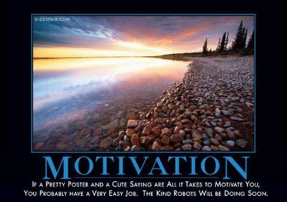

# Iron Quotes

## Description
So many funny things are said here at our school lets create a rest api to catalog them all.  This project will be pretty simple and focus on bi-directional relationships in the system. You may use templates for this project instead of the JQuery of previous projects. 

## Requirements
* Quote Class
	* Quote itself
	* Author
	* Date created
	* Collection of tags with a ManyToMany relationship
* Tags
	* Value of the tag
	* ManyToMany Relationship to the Quote
	* Date Added
* Core End points
	* CRUD for both objects
	* List of quotes
	* List of tags
* User
	* Username
	* Password
* User endpoints
	* Login
	* Logout

## Resources
* [Github Repo](https://github.com/tiy-lv-java-2016-06/iron-quotes)
